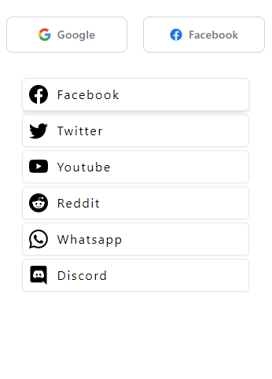

# About Dragon News
server: https://api-dragon-news.vercel.app

# Node & Express

- `res.send()` sends a response. Works for both object and string
- `res.json()` sends a **json** response.
- use middleware as `app.use(middleware_name())`

---

# PostCSS

```css
article {
  background: purple;

  & .title {
    /* & represents the article tag */
    font-size: 6rem;
  }

  & li {
    list-style-type: none;
  }
}
```

> similar to `article .title {...} and article li {...}`

## Now using this in tailwind

- tailwind have some selector elements which are nothing but [this](./src/assets/Screenshot_2.png)
- [they are](./src/assets/Screenshot_1.png) built in **_modifiers_** in tailwind
- use custom modifier as

```css
 <li class="[&:nth-child(3)]:underline">{item}</li>
```

> `&` represents the `li` tag

> at-rules like `@media` or `@supports` also can be inside arbitrary `[]`

- it will work as

```css
li:nth-child(3) {
  text-decoration-style: underline;
}
```

- now first example in tailwind

```html
<article className="bg-purple-400 [&.title]:text-8xl [&_li]:list-none">
  ...
  <p className="title">...</p>
  <li>...</li>
  <li>...</li>
  <li>...</li>
</article>
```

- though it is same as

```html
<article className="bg-purple-400">
  ...
  <p className="text-8xl">...</p>
  <li className="list-none">...</li>
  <li className="list-none">...</li>
  <li className="list-none">...</li>
</article>
```

## Handling whitespace

When an arbitrary value needs to contain a space, use an underscore (\_) instead and Tailwind will automatically convert it to a space at build-time:

```html
<div class="grid grid-cols-[1fr_500px_2fr]">
  <!-- ... -->
</div>
```

## css selectors comparison

for `<div><p>...</p></div>`

| Selectors         |                 Example                  |       CSS        |        PostCSS |
| :---------------- | :--------------------------------------: | :--------------: | -------------: |
| class             | `<div><p className='name'>...</p></div>` |    div .name     |         &.name |
| id                |    `<div><p id='name'>...</p></div>`     |    div #name     |         &#name |
| pseudo class      |             `<div>...</div>`             |    div:hover     |        &:hover |
| pseudo element    |             `<div>...</div>`             | div::first-child | &::first-child |
| all descendent    |         `<div><p>...</p></div>`          |     div name     |        &\_name |
| direct descendent |         `<div><p>...</p></div>`          |     div>name     |         &>name |
| siblings only     |      `<div>...</div><div>...</div>`      |     div~name     |         &~name |
| next sibling      |      `<div>...</div><div>...</div>`      |     div+name     |         &+name |

> though many of these modifiers are prebuilt in tailwind

| Modifier          |                                            CSS |
| :---------------- | ---------------------------------------------: |
| hover             |                                        &:hover |
| focus             |                                        &:focus |
| focus-within      |                                 &:focus-within |
| focus-visible     |                                &:focus-visible |
| active            |                                       &:active |
| visited           |                                      &:visited |
| target            |                                       &:target |
| first             |                                  &:first-child |
| last              |                                   &:last-child |
| only              |                                   &:only-child |
| odd               |                               &:nth-child(odd) |
| even              |                              &:nth-child(even) |
| first-of-type     |                                &:first-of-type |
| last-of-type      |                                 &:last-of-type |
| only-of-type      |                                 &:only-of-type |
| empty             |                                        &:empty |
| disabled          |                                     &:disabled |
| enabled           |                                      &:enabled |
| checked           |                                      &:checked |
| indeterminate     |                                &:indeterminate |
| default           |                                      &:default |
| required          |                                     &:required |
| valid             |                                        &:valid |
| invalid           |                                      &:invalid |
| in-range          |                                     &:in-range |
| out-of-range      |                                 &:out-of-range |
| placeholder-shown |                            &:placeholder-shown |
| autofill          |                                     &:autofill |
| read-only         |                                    &:read-only |
| before            |                                      &::before |
| after             |                                       &::after |
| first-letter      |                                &::first-letter |
| first-line        |                                  &::first-line |
| marker            |                                      &::marker |
| selection         |                                   &::selection |
| file              |                        &::file-selector-button |
| backdrop          |                                    &::backdrop |
| placeholder       |                                 &::placeholder |
| sm                |                      @media (min-width: 640px) |
| md                |                      @media (min-width: 768px) |
| lg                |                     @media (min-width: 1024px) |
| xl                |                     @media (min-width: 1280px) |
| 2xl               |                     @media (min-width: 1536px) |
| min-[…]           |                          @media (min-width: …) |
| max-sm            |          @media not all and (min-width: 640px) |
| max-md            |          @media not all and (min-width: 768px) |
| max-lg            |         @media not all and (min-width: 1024px) |
| max-xl            |         @media not all and (min-width: 1280px) |
| max-2xl           |         @media not all and (min-width: 1536px) |
| max-[…]           |                          @media (max-width: …) |
| dark              |            @media (prefers-color-scheme: dark) |
| portrait          |                 @media (orientation: portrait) |
| landscape         |                @media (orientation: landscape) |
| motion-safe       | @media (prefers-reduced-motion: no-preference) |
| motion-reduce     |        @media (prefers-reduced-motion: reduce) |
| contrast-more     |                @media (prefers-contrast: more) |
| contrast-less     |                @media (prefers-contrast: less) |
| print             |                                   @media print |
| supports-[…]      |                                  @supports (…) |
| aria-checked      |                         &[aria-checked=“true”] |
| aria-disabled     |                        &[aria-disabled=“true”] |
| aria-expanded     |                        &[aria-expanded=“true”] |
| aria-hidden       |                          &[aria-hidden=“true”] |
| aria-pressed      |                         &[aria-pressed=“true”] |
| aria-readonly     |                        &[aria-readonly=“true”] |
| aria-required     |                        &[aria-required=“true”] |
| aria-selected     |                        &[aria-selected=“true”] |
| aria-[…]          |                                      &[aria-…] |
| data-[…]          |                                      &[data-…] |
| rtl               |                                  [dir=“rtl”] & |
| ltr               |                                  [dir=“ltr”] & |
| open              |                                        &[open] |

# Acknowledgement

- [tailwindcss](https://tailwindcss.com)

- [postcss](https://postcss.com)

# Codemon

- map through react-icons

```js
const icons = [
  <BsFacebook />,
  <BsTwitter />,
  <BsYoutube />,
  <BsReddit />,
  <BsWhatsapp />,
  <BsDiscord />,
];
```

```js
return (
  <section className='mr-3'>
    <SocialButton />
    <div className='flex flex-col gap-1 mt-3 p-5 tracking-widest'>
      {icons.map((el) => (
        <div className='flex items-center gap-3 border p-2 text-2xl rounded-md cursor-pointer hover:shadow-md shadow-sm'>
          {el}
          <p className='text-base'>{el.type.name.replace("Bs", "")}</p>
        </div>
      ))}
    </div>
  </section>
);
```

Output:


